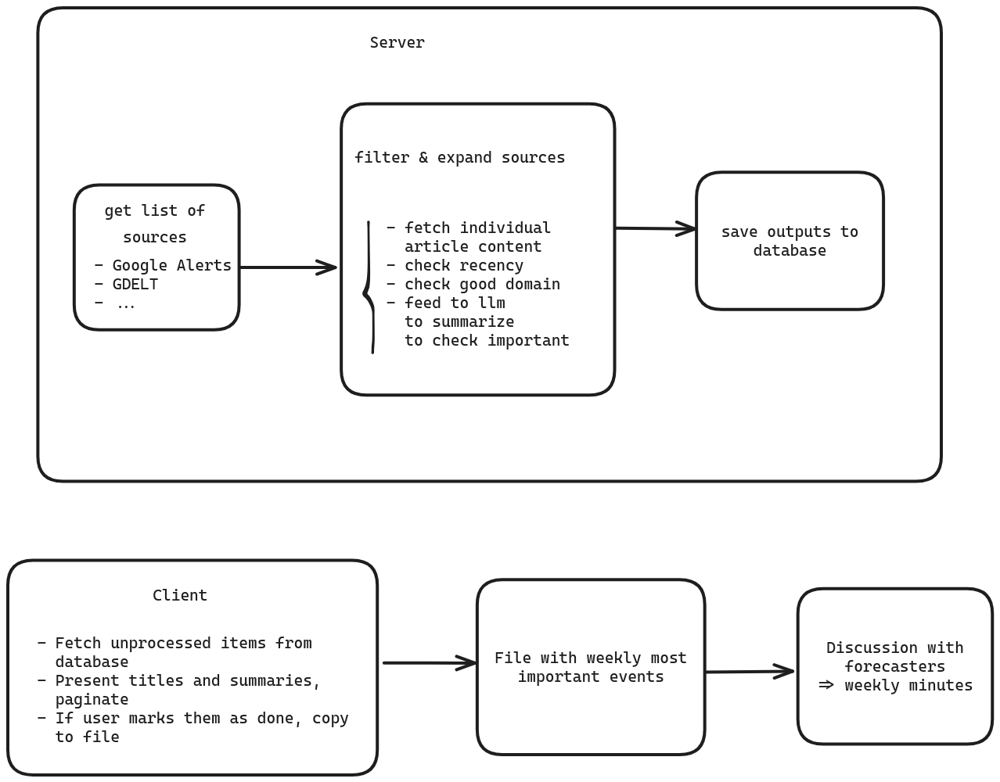
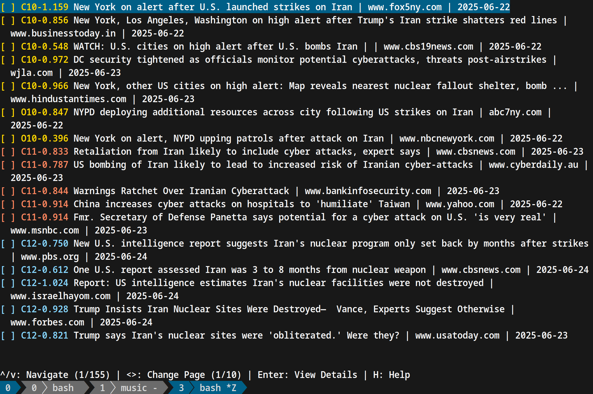
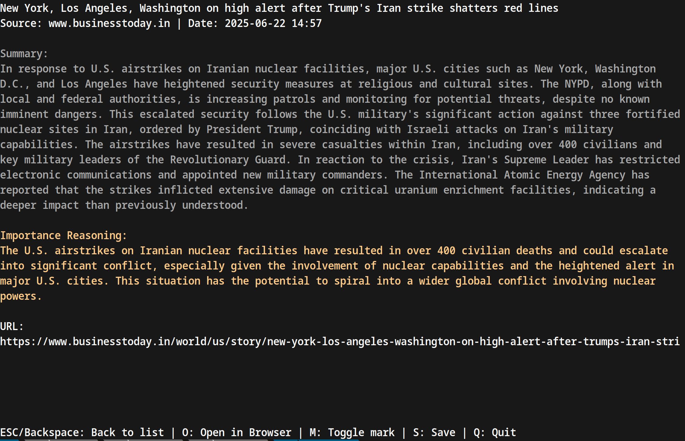

# Eye of Sauron


## About 

This is a program that surveys many sources on the internet to find existentially important news—operationally defined as events that could kill over 1M people, and precursors thereof. 

The main sources we are parsing are:

- Google news
- [GDELT](https://www.gdeltproject.org/)
- Chinese military news from mil.gmw.cn 
- Wikipedia current events
- Twitter (WIP)

We are also parsing: HN, CNN, Weapons sales announcements, the whitehouse presidential actions feed, and have a long list of other sources we want to incorporate in guides/ROADMAP.md.

News are first parsed on a server, filtered using LLMs, clustered, and then manually filtered with the UI defined in the client folder. The results are then discussed by forecasters and aggregated into Sentinel's [Global Risks Weekly Roundup](https://blog.sentinel-team.org/).



## Built with

- Linux
- Golang/Python
- Ncurses
- Postgres
- OpenAI
  - LLMs
  - Embeddings
- Systemd 

## Getting started

### Clone this repository

with ssh—recommended to be able to make contributions back, but requires setting up ssh keys with github:

```
git clone git@github.com:NunoSempere/eye-of-sauron.git
```

with https:

```
git clone https://github.com/NunoSempere/eye-of-sauron.git
```

### Getting started with the server

Configure .env files. You can see .env.example files, but the easiest way is probably to ask Nuño either for the .env contents, or for authorization for our production server.

With [Python](https://www.python.org/)  and [uv](https://github.com/astral-sh/uv):

```
cd server/sources/globalbiodefense-py
make setup
make run
```

With [golang](https://go.dev/) :

```
cd server/sources/gdelt
make run
make listen
```

### Getting started with the client

Configure the .env files, then 

```
cd client/articles
make 
```

You will see a ncurses based application, which looks as follows.





Actions you can do from the main screen are:

- navigate between items and pages with the arrow keys
- mark/unmark an item as processed with x
- mark/unmark a whole page as processed with X
- filter out for keywords with f (then write the keyword, then press enter). This is particularly useful for filtering duplicates quickly.
- open in browser. This might require to customize the logic for your OS+browser combination
- save to a file. You can configure which folder in the .env file.
- expand the items with enter to also show their summary
- mark items in a cluster all as processed
- etc.

Similarly, for the wip twitter client:

```
cd client/tweets
make 
```

## Roadmap and contributions

You can see our roadmap in guides/ROADMAP.md, as well as some notes on coding standards on guides/CODING.md 

## Licensing

This repository is part of the unique Sentinel alpha, so we're hesitant to release it with an open source version. We're thus releasing it under the [Attribution-NonCommercial 4.0 International](https://creativecommons.org/licenses/by-nc/4.0/) license, meaning that this is free to use and distribute for noncommercial uses. If this is a hurdle, let us know.
